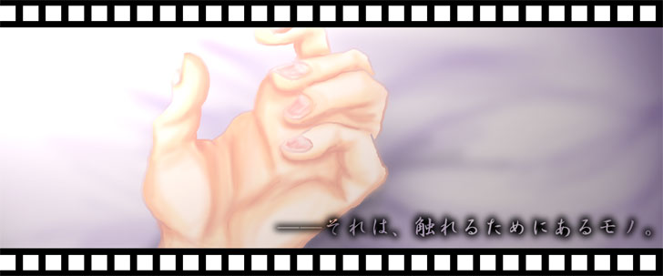

以下は旧公開ページをGitHubに合わせて最小限変更した内容になります。

----------

illustration：鈴風さん（http://huuryuu.bake-neko.net/index/index.html）

ここにはまっとうなゴーストはありません。帰れ。

## The Hand phase 'xxxx'

↑こんな感じです。いやらしいですね。

### なにこれ

- SAORIで色々いじってみるテスト。
- 界隈初？のセクハラゴーストです。一緒に立ってるゴーストにあんなことやこんなことをします。
- ていうか嫌ゴです。
- 某ゴーストマスタさんに「生理的に受け付けない」と言われました。最強。
- 右のReleasesから最新版をダウンロードできます。（phase 'xxxx' 2008-05-29～随時更新）

### 履歴

- 2004/05/?? 第一版作成、しばらくほったらかし
- 2005/05/09 色々修正して Phase "xx" 作成
- 2005/05/10 FA-Xさん（http://fa-x.hp.infoseek.co.jp/）作成の「小さいバルーン」を同梱させて頂きました。感謝。
- 2006/05/25 だーいぶ書き直して、必殺技つけて、Phase "xxx" になりました。
- 2006/09/29 はんどたん対応。Special Thanks to 高遠結奈さま（http://yuina.s6.xrea.com/）
- 2006/11/20 はんどたんに声がつきました。Special Thanks to みゅんさん
- 2007/02/27 必殺技ロジックを更新。必殺技４を追加。
- 2008/05/29 Phase "xxxx" **大幅な変更なのでアーカイブ入れなおしを推奨します。**
  - コア部分を最新のYAYAシステムに合わせ書き直し。
  - トーク少し追加。はんどたん当たり判定追加。
- 2026/02/23 GitHub YAYA-shiori org.に収容

### 制限事項やなんか

- SSP 1.10.00 (RC1)以上でないとほぼ使えません。
- 他のゴーストと一緒に立てて、放っておくか、ダブルクリックしてください。
- ちょっと重いです。

## はんどたん

- 高遠結奈様が作成してくださった、The Handの追加シェルです。
- シェルを変えるとHandの挙動も変わります。
- かわいいです。

高遠結奈様「つきゆり」
http://yuina.s6.xrea.com/

「つきゆり」内「The Hand」専用シェル「Hand Girl」公開場所
http://yuina.s6.xrea.com/ukagaka/

## Hand関連ドキュメント

### Hand用の特殊処理を行いたい方へ

詳しくは [Hand特殊イベント](hand_special_event.md) を見てください。

### Hand対応/被対応一覧

Handが特別な対応を行っている、あるいはHandに特別な対応を行って下さってるゴーストの一覧です。

[Hand対応](hand_compatible_ghost.md)

ヴィイさんとコミュニケーション連鎖を行った際のノウハウをまとめました。

[コミュニケーション連鎖](hand_communicate.md)

### お年頃の娘を抱えたゴーストマスター様へ

- うちの娘に何をするんだっ！という方、お申し出下されば触らないようにします。

### はんどたんのできるまで

- http://d.hatena.ne.jp/hakuma/20060920/p2
- http://yuina.s6.xrea.com/x/diary/nicky.cgi?DT=20060922
- http://hiho.boo.jp/soramimi/log/eid306.html
- http://d.hatena.ne.jp/wiz-stargazer/20060921
- http://metalwing.blog.shinobi.jp/Entry/189/
- http://metalwing.blog.shinobi.jp/Entry/187/
- http://niselog.blog.shinobi.jp/Entry/17/
- http://taimagro.blog.shinobi.jp/Entry/71/
- http://www12.plala.or.jp/canaanM/pack/s/g001.html
- http://yuina.s6.xrea.com/x/diary/nicky.cgi?DT=20060929

### 伺デミー

- 伺デミー技術賞予選（2006/08/31）にノミネートいただきました。
  - Handから一言。[./伺デミー予選突破記念](./伺デミー予選突破記念)
- 伺デミー技術賞決戦（2006/09/19）にノミネートいただきました。

## ゴーストの扱いについて

基本的になにをしてもオッケーです。

